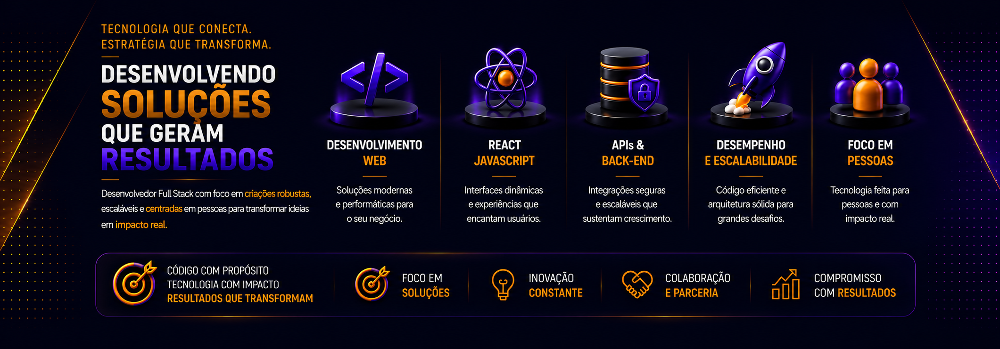

<h1 align="center">Olá, 👋 me chamo Clayton Marcelo!</h1>
<h3 align="center">Fascinado por tecnologia, Análise de dados, Mobile no mundo digital.</h3>

- 📝 Projetos realizados em grupo através da faculdade [Pedido Agora](https://github.com/Claytonmarcelo/pedidoagora-main/tree/main) | [Fitplan Academy](https://github.com/Claytonmarcelo/fitplan_academy)

- 🧑‍💻 Meus projetos pessoais e desenvolvimentos acadêmicos [foodexpress](https://github.com/claytonmarcelo/foodexpress) | [M-Food-Delivery](https://github.com/claytonmarcelo/M-Food-Delivery) | [FleetPulse](https://github.com/claytonmarcelo/FleetPulse) | [Nexus-Horizon](https://github.com/claytonmarcelo/Nexus-Horizon) | [Petit-Vet](https://github.com/claytonmarcelo/Petit-Vet) | [Infinite-Atari](https://github.com/claytonmarcelo/Infinite-Atari)

- 📚 Atualmente estou aprendendo **Multiplataforma (Híbrido) (Android/iOS), Flutter (Dart), React Native, (JavaScript/TypeScript), Node.js**

- ▶️ Tenho um canal no YouTube [Trabalhos acadêmicos e projetos](https://www.youtube.com/@c.marcelodev.brasil)

- 📫 Você me acha... **claytonlima10@gmail.com**

- 🌍 Meu LinkedIn [https://www.linkedin.com/in/clayton-marcelo-270602352/](https://www.linkedin.com/in/clayton-marcelo-270602352/)

<h3 align="left">Conecte-se comigo:</h3>

  

<h3 align="left">Idiomas e Ferramentas:</h3>

 

Constantly striving to be better than before. 🧠
* Studying Systems Analysis and Development at Unisuam University. 👨‍🎓
* Professional career transition, dedicated to growth every day.
* Believing in my efforts to overcome barriers and become the best.

# My Stack

<h3 align="center">🛠️ Technologies & Tools</h3>

🔽 Clique aqui para ver em Português

 

* Sempre tentando ser melhor do que antes. 🧠
* Em transição de carreira, dedicado ao crescimento a cada dia. 👨‍🎓
* Estudando Análise e Desenvolvimento de Sistemas na Universidade Unisuam. 👨‍🎓

